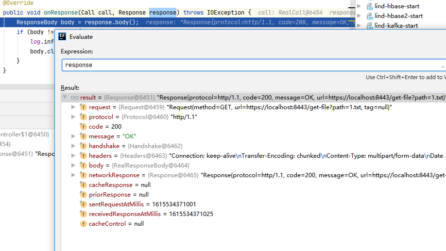
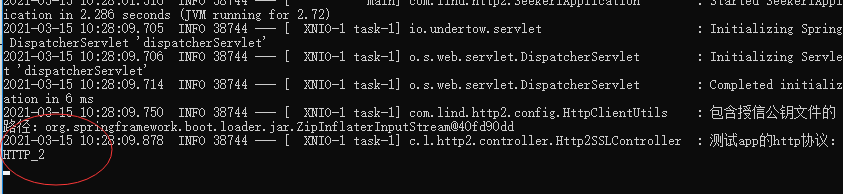

# 说明
springboot+okhttp3实现http2.0的访问
# 目前客户端调用https的http2.0的接口，响应还是http1.1

# jdk8的客户端添加http2
如果使用alpn-boot,但它和jdk版本号有关，版本不匹配，也还是http1.1,最好的方式就是升级jdk
```
java -Xbootclasspath/p:/D/github/lind-start/a-start-http2/src/main/resources/lib/alpn-boot-8.1.12.v20180117.jar -jar target/a-start-http2-1.0.0.jar
```
# jdk11下的http2
jdk9以后,可以直接启动jar,它就是支持http2.0的
```js
java -jar target/a-start-http2-1.0.0.jar
```

